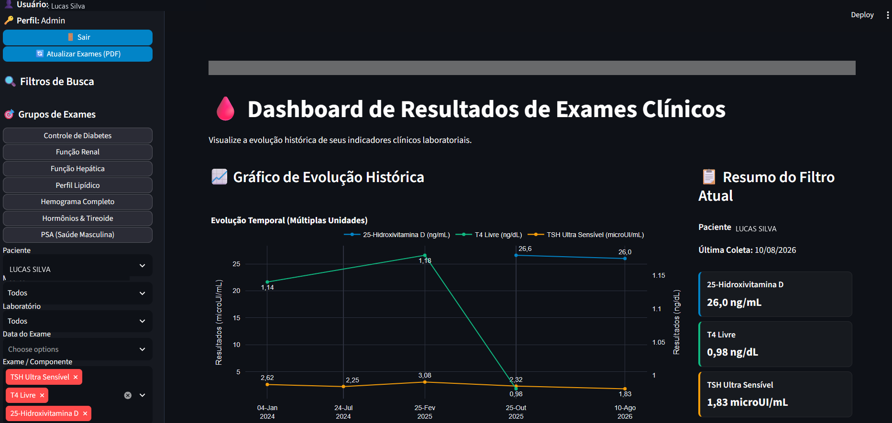
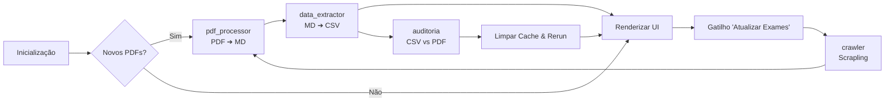

# 🏥 Plataforma Inteligente de Coleta de Dados e Análise de Exames Clínicos

Esta plataforma automatiza de ponta a ponta a coleta, processamento, validação e monitoramento temporal de resultados de exames laboratoriais a partir de portais de laudos clínicos.


[](LICENSE)




---

## 📚 Índice

- [🏥 Plataforma Inteligente de Coleta de Dados e Análise de Exames Clínicos](#-plataforma-inteligente-de-coleta-de-dados-e-análise-de-exames-clínicos)
  - [📚 Índice](#-índice)
  - [🎯 Sobre o Projeto](#-sobre-o-projeto)
    - [🎯 O Que Este Projeto Faz:](#-o-que-este-projeto-faz)
  - [🔄 Fluxo de Processamento e Execução](#-fluxo-de-processamento-e-execução)
    - [1. Inicialização Automática (Incremental)](#1-inicialização-automática-incremental)
    - [2. Sincronização em Tempo Real (Botão de Atualização)](#2-sincronização-em-tempo-real-botão-de-atualização)
    - [📊 Fluxograma do Pipeline](#-fluxograma-do-pipeline)
  - [✨ Características](#-características)
  - [📁 Estrutura do Projeto](#-estrutura-do-projeto)
  - [🛠️ Pré-requisitos](#️-pré-requisitos)
  - [🚀 Instalação e Setup](#-instalação-e-setup)
    - [Instalação Rápida (Windows - PowerShell)](#instalação-rápida-windows---powershell)
    - [Instalação Manual (Passo a Passo)](#instalação-manual-passo-a-passo)
  - [🔧 Configuração (config.ini)](#-configuração-configini)
  - [🏃 Como Executar os Módulos](#-como-executar-os-módulos)
    - [📊 1. Rodar Dashboard Streamlit (Orquestrador)](#-1-rodar-dashboard-streamlit-orquestrador)
    - [🕷️ 2. Módulos Auxiliares Individuais](#️-2-módulos-auxiliares-individuais)
  - [🧰 Scripts Utilitários](#-scripts-utilitários)
    - [🔄 Como usar o reset](#-como-usar-o-reset)
  - [🛡️ Exemplo de Relatório de Auditoria](#️-exemplo-de-relatório-de-auditoria)
  - [🧪 Suíte de Testes](#-suíte-de-testes)

---

## 🎯 Sobre o Projeto

O objetivo principal deste projeto é consolidar dados espalhados em PDFs de exames médicos de portais de laboratórios clínicos em um banco de dados unificado por paciente, permitindo analisar visualmente a evolução de taxas médicas ao longo do tempo.

### 🎯 O Que Este Projeto Faz:
* 🌐 **Automação de Downloads:** Efetua login automatizado e faz download dos PDFs mais recentes dos laboratórios configurados.
* ⚙️ **Processamento Incremental:** Extrai o texto dos PDFs brutos e os converte para o formato estruturado Markdown.
* 📊 **Estruturação de Indicadores:** Converte os dados estruturados de Markdown para tabelas CSV exclusivas por paciente.
* 🛡️ **Auditoria de Dados:** Executa validação de qualidade cruzada de forma amostral e direta contra o **PDF original**.
* 🎨 **Dashboard Interativo:** Centraliza a visualização histórica com gráficos temporais reativos e filtros avançados.

[voltar ao topo](#-índice)

---

## 🔄 Fluxo de Processamento e Execução

O sistema possui duas formas de orquestração do processamento de dados: **Execução Automática na Inicialização** e **Sincronização sob Demanda**.

### 1. Inicialização Automática (Incremental)
Ao subir o servidor do Streamlit (`streamlit run app/dashboard.py`), o painel verifica automaticamente o diretório `data/exames/` à procura de arquivos PDF que ainda não tenham sido processados. Se encontrar, ele executa incrementalmente o pipeline de conversão (PDF ➔ MD ➔ CSV) antes de renderizar os gráficos.

### 2. Sincronização em Tempo Real (Botão de Atualização)
Na barra lateral do painel, há o botão **"🔄 Atualizar Exames"**. Quando clicado, ele dispara a cadeia de processamento completa, acionando inclusive a raspagem web dinâmica das credenciais ativas. O progresso é exibido em tempo real na interface através de um componente `st.status` com as etapas do pipeline detalhadas.

### 📊 Fluxograma do Pipeline



[voltar ao topo](#-índice)

---

## ✨ Características

* **Isolamento de Dados:** Cada paciente cadastrado possui sua própria base de dados CSV protegida e isolada.
* **Crawler Adaptativo:** Implementado com [D4vinci/Scrapling](https://github.com/D4vinci/Scrapling), suportando sessões dinâmicas assíncronas contra mecanismos de segurança.
* **Validação Amostral Cruzada (Auditoria 100%):** Lógica independente que abre os PDFs brutos originais e busca os dados gravados no CSV de forma contextual. Configurado por padrão para **100% de amostragem** (`AUDIT_SAMPLE_PERCENTAGE = 1.0`) para dados de saúde.
* **Design Premium Dark Mode:** Dashboard customizado com estilos modernos CSS sob medida para Streamlit.
* **Gráficos Dinâmicos com Eixo Duplo:** O Plotly projeta indicadores com unidades diferentes (ex: `mg/dL` vs `%`) no mesmo gráfico sem quebrar a escala.
* **Posicionamento Dinâmico de Rótulos:** Algoritmo dinâmico que detecta pontos coincidentes no tempo e altera as posições de texto (`textposition`) para evitar sobreposições de anotações no gráfico.
* **Cards de Métricas Inteligentes:** Exibição ultra compacta das últimas coletas de exames com a cor da fonte e da borda esquerda sincronizadas à linha do gráfico correspondente.
* **Sistema de Logging Robusto:** Integração com a biblioteca `loguru` para logs estruturados, coloridos no console e gravados de forma rotativa diária em `_temp/pipeline.log`.

[voltar ao topo](#-índice)

---

## 📁 Estrutura do Projeto

```markdown
exames/
├── config.ini                   # Credenciais e parâmetros do crawler/pacientes (Ignorado no Git)
├── config.ini_example           # Template de exemplo para configuração
├── LICENSE                      # Licença MIT
├── .gitignore                   # Filtros do repositório Git
├── requirements.txt             # Dependências da aplicação Python
├── setup.ps1                    # Script automático de setup do ambiente local
├── run.ps1                      # Script auxiliar para executar o Dashboard
├── resetall.ps1                 # Script para apagar todos os dados gerados e reiniciar do zero
├── README.md                    # Este guia completo do projeto
│
├── _docs/                       # Documentação técnica do projeto
│   ├── PRD.md                   # Documento de Requisitos de Produto
│   └── TASKS.md                 # Cronograma de desenvolvimento e tarefas
│
├── data/                        # Ciclo de dados do ecossistema
│   └── exames/                  # Gestão de exames e laudos locais
│       ├── paciente_*.pdf       # PDFs brutos de exames baixados pelo crawler
│       ├── exames_md/           # Arquivos Markdown convertidos do PDF
│       ├── auditoria/           # Relatórios históricos de auditoria de qualidade
│       │   └── auditoria_valores_*.md
│       ├── output/              # Screenshots de erro de login (debugging do crawler)
│       └── results/             # Base de dados estruturada por paciente
│           ├── results-*.csv      # Dados tabulares individuais
│           └── results-*.csv.bak  # Backups automáticos de segurança
│
└── app/                         # Scripts lógicos da aplicação
    ├── crawler.py               # Robô de raspagem e download (Scrapling)
    ├── pdf_processor.py         # Conversor de PDFs originais para Markdown
    ├── data_extractor.py        # Extrator e consolidador de dados do Markdown para o CSV
    ├── auditoria.py             # Script para validação cruzada independente (CSV vs PDF)
    └── dashboard.py             # Interface Streamlit e orquestrador principal do pipeline
```

[voltar ao topo](#-índice)

---

## 🛠️ Pré-requisitos

* Python 3.13 ou superior instalado.
* Acesso à internet para download de dependências e interação com os portais dos laboratórios.

[voltar ao topo](#-índice)

---

## 🚀 Instalação e Setup

### Instalação Rápida (Windows - PowerShell)
Execute o script auxiliar na raiz do projeto para criar o ambiente virtual, atualizar o `pip`, instalar as dependências e baixar os navegadores do Playwright usados pelo Scrapling:
```powershell
./setup.ps1
```

### Instalação Manual (Passo a Passo)
1. Crie o ambiente virtual:
   ```bash
   python -m venv venv
   ```
2. Ative o ambiente virtual:
   * **PowerShell:** `.\venv\Scripts\activate`
   * **CMD:** `.\venv\Scripts\activate.bat`
   * **Linux/macOS:** `source venv/bin/activate`
3. Instale as dependências:
   ```bash
   pip install -r requirements.txt
   ```
4. Baixe os binários de navegação do Scrapling:
   ```bash
   scrapling install
   ```

[voltar ao topo](#-índice)

---

## 🔧 Configuração (config.ini)

Copie o arquivo de exemplo [`config.ini_example`](file:///E:/Projetos/exames/config.ini_example) para `config.ini` na raiz do projeto e configure suas credenciais de acesso, links dos laboratórios e parâmetros globais. **Atenção: O arquivo `config.ini` contém informações sensíveis e é ignorado no Git**.

```bash
cp config.ini_example config.ini
```

```ini
[Config]
# Limite máximo de exames mais recentes para download por paciente
LIMIT_EXAM_DOWNLOAD = 2

# Porcentagem de amostragem da auditoria (1.0 = 100% - recomendado para exames de saúde)
AUDIT_SAMPLE_PERCENTAGE = 1.0

[Laboratorios]
# Defina o nome do laboratório e a URL de login do portal de exames correspondente
exemplo_lab = https://portal.exemplo.com.br/shift/login

[Pacientes]
# Configure os pacientes no formato JSON dict (em uma única linha)
# Associe o laboratório correspondente à chave "lab"
# Parâmetro "role" pode ser "admin" (acesso a dados de todos os pacientes) ou "user" (restrito aos seus próprios dados)
paciente_1 = {"nome": "Nome Completo do Paciente", "user": "Usuario", "pass": "MinhaSenha", "lab": "exemplo_lab", "role": "admin"}
```

[voltar ao topo](#-índice)

---

## 🏃 Como Executar os Módulos

### 📊 1. Rodar Dashboard Streamlit (Orquestrador)
Esta é a forma recomendada de uso, pois o dashboard orquestra todas as conversões de arquivos locais na inicialização e possui o botão de atualização em lote.

* **Execução Rápida (Windows - PowerShell):**
  ```powershell
  ./run.ps1
  ```
* **Execução Manual (Qualquer Plataforma):**
  Ative o ambiente virtual e execute:
  ```bash
  streamlit run app/dashboard.py
  ```

### 🕷️ 2. Módulos Auxiliares Individuais
Se desejar executar tarefas fora da interface gráfica:
* **Executar apenas o Crawler (Download de PDFs):**
  ```bash
  python app/crawler.py
  ```
* **Executar apenas o Conversor (PDF para MD):**
  ```bash
  python app/pdf_processor.py
  ```
* **Executar apenas o Extrator (MD para CSV):**
  ```bash
  python app/data_extractor.py
  ```
* **Executar apenas o Auditor (Validação de Dados):**
  ```bash
  python app/auditoria.py
  ```

[voltar ao topo](#-índice)

---

## 🧰 Scripts Utilitários

| Script | Descrição |
|--------|-----------|
| [`setup.ps1`](setup.ps1) | Cria o venv, instala dependências e baixa os binários do Playwright |
| [`run.ps1`](run.ps1) | Ativa o venv e inicia o dashboard Streamlit |
| [`resetall.ps1`](resetall.ps1) | **Apaga todos os dados gerados** (PDFs, MDs, CSVs, auditorias, logs) para reiniciar do zero |

### 🔄 Como usar o reset

```powershell
./resetall.ps1
```

O script exibirá a lista do que será apagado, pedirá uma confirmação digitando **`sim`** e removerá:
- `data/exames/*.pdf` — PDFs baixados pelo crawler
- `data/exames/exames_md/` — Markdowns convertidos
- `data/exames/results/` — CSVs e backups por paciente
- `data/exames/auditoria/` — Relatórios de auditoria
- `data/exames/output/` — Screenshots de erro do crawler
- `_temp/pipeline.log` — Log do pipeline

Após o reset, execute `./run.ps1` e o pipeline rodará completamente do zero ao clicar em **Buscar Exames**.

> **Dica:** Use [`config.ini`](config.ini) para aumentar o `LIMIT_EXAM_DOWNLOAD` antes de rodar com mais carga.

[voltar ao topo](#-índice)

---

## 🛡️ Exemplo de Relatório de Auditoria

Abaixo está um exemplo minimalista do relatório de auditoria gerado dinamicamente pelo módulo `auditoria.py` após confrontar os dados estruturados contra o texto extraído do **PDF original**:

```markdown
# Relatório de Auditoria de Qualidade dos Dados (Validação Cruzada PDF Original)
**Data de Execução:** 2026-08-14 16:20:00
**Arquivo de Dados Auditado:** `results-lucas_silva.csv`

Este relatório apresenta a verificação amostral de 100.0% dos dados estruturados no CSV confrontando diretamente o texto extraído do **PDF original**.

## Resumo da Auditoria
* **Total de registros no CSV:** 45
* **Tamanho da amostra (100.0%):** 45
* **Amostras com sucesso:** 45
* **Amostras com falha:** 0
* **Taxa de Sucesso:** 100.0%

## Detalhes das Amostras Auditadas

| Componente | Data | Resultado Esperado (CSV) | Mensagem de Validação do PDF | Status |
| --- | --- | --- | --- | --- |
| Glicose | 10/08/2026 | 90 mg/dL | Verificado no PDF (pág 1): 'GLICOSE 90 mg/dL' | ✅ OK |
| Colesterol Total | 10/08/2026 | 180 mg/dL | Verificado na pág 1 (busca contextual do termo 'COLESTEROL TOTAL') | ✅ OK |
| Vitamina D | 10/08/2026 | 30 ng/mL | Verificado na pág 2 (busca contextual do termo 'VITAMINA D') | ✅ OK |
```

[voltar ao topo](#-índice)

---

## 🧪 Suíte de Testes

Para validar a integridade de todas as classes e funções, execute a suíte total de testes automáticos (certifique-se de executar com o ambiente virtual ativo):
```bash
# Windows (PowerShell)
.\venv\Scripts\python tests/run_tests.py

# Qualquer plataforma (Com venv ativado)
python tests/run_tests.py
```

[voltar ao topo](#-índice)
